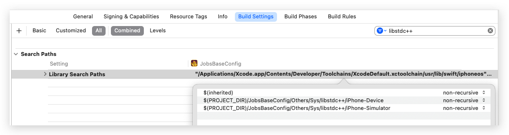

#  libstdc++
*xcode之前包含的而后面呗移除的库*
*直接拖拽项目文件夹到`Library Search Paths`里面自动生成路径*
##   <a href="#前言" style="font-size:17px; color:green;"><b>🔼</b></a> <a href="#🔚" style="font-size:17px; color:green;"><b>🔽</b></a>

<a id="🔚" href="#前言" style="font-size:17px; color:green; font-weight:bold;">我是有底线的➤点我回到首页</a>
